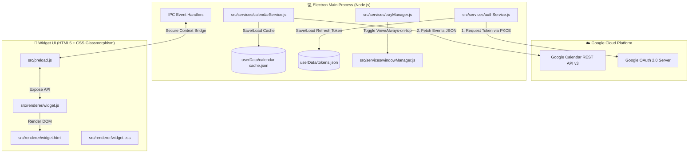

# 📐 Spesifikasi & Rencana Arsitektur Baru: Native Google Calendar Desktop Widget

> **Dokumen Desain & Perbandingan Arsitektur**  
> **Target:** Transformasi dari *Webview CSS-Injected Companion* menuju *True Native Desktop Widget* bertenaga **Google Calendar API v3**.

---

## 🌟 1. Visi & Tujuan Arsitektur Baru

Tujuan dari refaktorisasi ini adalah mengubah aplikasi dari sekadar "jendela browser kecil yang memuat website Google Calendar" menjadi **Widget Desktop Sejati (True Desktop Widget)** yang:
1. **Super Estetik & Modern**: Tampilan frameless (tanpa bingkai OS), glassmorphism transparan yang elegan, menyatu indah dengan wallpaper desktop.
2. **Kinerja Sangat Ringan & Cepat**: Mengonsumsi RAM < 40MB (dibandingkan webview Google yang menghabiskan 150-300MB).
3. **100% Kebal Perubahan Google**: Mengambil data jadwal murni via REST API resmi (`googleapis`), tidak lagi bergantung pada class name HTML Google (`.gb_Cd`, `.r4nke`, dll) yang bisa rusak sewaktu-waktu.
4. **Widget Experience Sesungguhnya**: Fitur *Always-on-Top toggle*, *Draggable* ke mana saja di layar, *Live Countdown* ke acara berikutnya, dan *Offline Caching*.

---

## ⚖️ 2. Perbandingan Mendalam: Codebase Sekarang vs Arsitektur Baru

| Fitur / Aspek | Codebase Sekarang (Webview Scraping) | Arsitektur Baru (Native API Widget) |
|---|---|---|
| **Sumber Data** | Memuat seluruh website `calendar.google.com` (HTML, JS, CSS raksasa milik Google). | Mengambil data murni **JSON** langsung dari **Google Calendar API v3** resmi. |
| **Tampilan / UI** | Tampilan web Google Calendar yang disuntik CSS (`display: none` pada header/sidebar). | **Custom Native UI** buatan sendiri dengan tema Glassmorphism transparan modern. |
| **Konsumsi RAM & CPU** | **Tinggi** (150MB - 300MB RAM) karena menjalankan seluruh web app Google Calendar. | **Sangat Ringan** (30MB - 50MB RAM) karena hanya merender template HTML/CSS lokal. |
| **Transparansi & Estetika Widget** | Terbatas (background web Google tidak bisa transparan tembus ke wallpaper). | **100% Transparan / Glassmorphism** (tembus ke wallpaper desktop Windows). |
| **Ketahanan Jangka Panjang** | **Rentan rusak** jika Google memperbarui class selector CSS di websitenya. | **100% Stabil & Tahan Banting** karena menggunakan kontrak REST API v3 resmi. |
| **Window & Interaktivitas** | Window standar dengan titlebar OS (`_ [] X`). | **Frameless**, draggable (`-webkit-app-region: drag`), dan Always-on-Top toggle. |
| **Otentikasi Akun** | Cookie browser session di webview. | **OAuth 2.0 PKCE resmi** via `client_secret.json` dengan auto-refresh token. |
| **Dukungan Offline** | Menampilkan layar error "No Internet" jika offline. | **Offline Cache**: Tetap menampilkan jadwal terakhir yang tersimpan saat internet mati. |

---

## 🏗️ 3. Diagram Arsitektur Sistem Baru



---

## 📦 4. Struktur Modul & Komponen Baru

```
google-calender-widget/
├── client_secret.json            ← Kredensial OAuth 2.0 dari Google Cloud Console
├── src/
│   ├── config/
│   │   └── constants.js          ← Scope OAuth, interval refresh, default dimensions
│   ├── services/
│   │   ├── authService.js        ← Otentikasi OAuth 2.0 (Loopback server & token refresh)
│   │   ├── calendarService.js    ← Client Google Calendar API (fetch, parse, cache)
│   │   ├── windowManager.js      ← Pengaturan frameless, transparansi, always-on-top
│   │   └── trayManager.js        ← Context menu tray (Always on top, refresh, logout)
│   ├── renderer/
│   │   ├── widget.html           ← Layout widget (Header, Countdown, Event List, Mini Calendar)
│   │   ├── widget.css            ← Desain Glassmorphism (blur background, dark theme, glowing badges)
│   │   └── widget.js             ← Interaktivitas client (format tanggal, filter view, countdown live)
│   ├── utils/
│   │   ├── paths.js              ← Path resolver
│   │   └── dateHelper.js         ← Formatting tanggal (Today, Tomorrow, jam, countdown)
│   ├── app.js                    ← App bootstrapping & IPC orchestration
│   └── preload.js                ← Context isolation bridge (aman & terisolasi)
├── test/                         ← Unit test suite untuk auth, parser, dan helper
├── index.js                      ← Entry point (Composition root)
└── package.json
```

---

## 🎨 5. Spesifikasi Tampilan & Fitur Widget Baru

### 1. Visual Design (Glassmorphism Dark Theme)
- **Background**: Semi-transparan (`rgba(18, 18, 24, 0.75)`) dengan efek `backdrop-filter: blur(20px)`.
- **Border**: Garis tepi halus dengan gradasi lembut (`rgba(255, 255, 255, 0.1)`).
- **Tipografi**: Menggunakan font modern (*Inter / Google Sans / Segoe UI*).
- **Event Cards**: Kartu acara dengan aksen strip warna sesuai warna kalender Google aslinya (biru, hijau, merah, kuning, dsb).

### 2. Fitur Interaktif Widget
- **Live Countdown Banner**: Menampilkan acara terdekat berikutnya (contoh: *"⚡ Rapat Tim dalam 25 menit"*).
- **View Switcher Tabs**:
  - 📋 **Agenda View**: Daftar agenda terorganisir per hari (*Hari Ini, Besok, Minggu Ini*).
  - 📅 **Mini Month View**: Kalender bulanan interaktif dengan titik penanda tanggal yang memiliki acara.
  - ☀️ **Day View**: Jadwal detail per jam untuk hari yang dipilih.
- **Draggable Header**: Pengguna bisa klik dan geser bagian atas widget untuk memindahkannya ke posisi mana pun di desktop.
- **Always on Top Toggle**: Bisa diaktifkan/dinonaktifkan langsung dari klik kanan Tray Menu atau tombol pin kecil di widget.
- **Auto-Sync Cerdas**: Memperbarui data setiap 10 menit di latar belakang atau instan saat tombol *Refresh* diklik.

---

## 🔐 6. Mekanisme Otentikasi (OAuth 2.0 PKCE Flow)

1. Saat pertama kali dibuka dan belum login, aplikasi menyalakan loopback HTTP server lokal sementara di `http://127.0.0.1:port`.
2. Aplikasi membuka browser bawaan pengguna (Chrome/Edge) ke halaman login persetujuan Google.
3. Setelah user mengklik *Allow*, Google me-redirect ke `http://127.0.0.1:port` dengan *Authorization Code*.
4. Aplikasi menukarkan kode tersebut dengan **Access Token** dan **Refresh Token**.
5. Server loopback ditutup, token disimpan terenkripsi/aman di `userData/tokens.json`.
6. Setiap kali Access Token habis masa berlakunya (setelah 1 jam), `authService.js` otomatis memperbaruinya di background menggunakan Refresh Token tanpa mengganggu pengguna.

---

## 📋 7. Rencana Eksekusi Bertahap

1. **Fase 1: Dependencies & Core Services**:
   - Install `googleapis` via npm.
   - Buat `authService.js` dan `calendarService.js` untuk mengambil event kalender dalam bentuk JSON.
2. **Fase 2: Renderer & Glassmorphism UI**:
   - Bangun `widget.html`, `widget.css`, dan `widget.js` dengan desain modern glassmorphism.
3. **Fase 3: Window & Desktop Integration**:
   - Konfigurasi `BrowserWindow` frameless, transparan, draggable, dan always-on-top di `windowManager.js`.
   - Update `trayManager.js` dan `preload.js` (IPC bridge).
4. **Fase 4: Testing & Verifikasi**:
   - Uji coba login akun Google, sinkronisasi jadwal, dan verifikasi tampilan widget di layar.
